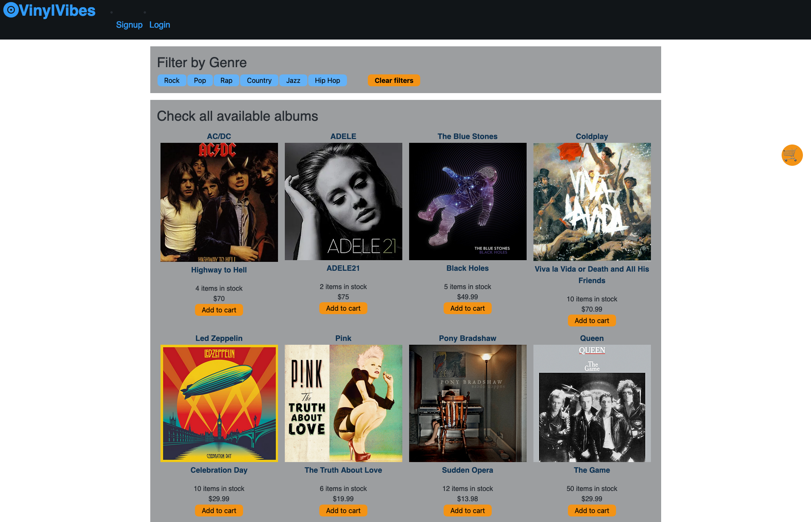
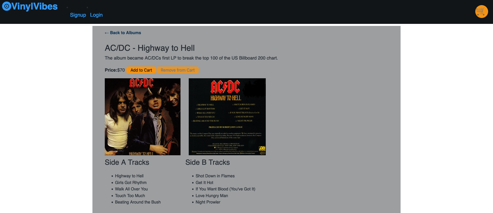

# vinyl-vibes

## Description
This single-page e-commerce website is specifically designed for customers interested in purchasing vinyl albums. It offers a various selection of genres, including Rock, Pop, Rap, Country, Jazz, and Hip-hop. The website is developed using the MERN stack, leveraging React and Express as the frontend framework, and MongoDB and Node.js for the backend. Users have the ability to effortlessly browse and select albums from various genres, gaining access to comprehensive details about each album and its respective artist upon clicking. This includes a concise album description, pricing information, and the option to add the album to their cart. Furthermore, users are provided with the opportunity to explore the album's song list as well as view the front and back covers before making a final purchasing decision. In order to proceed with a purchase, users can either sign up for a new account or log in to an existing one, ensuring a seamless user experience. Additionally, the website offers users the flexibility to delete their account as needed.

## Built With
* CSS
* JavaScript
* MERN (MongoDB, Express, React.js and Node.js)

## Installation
To get a local copy up and running, 
1.Clone this repository https://github.com/dimartoro/vinyl-vibes to your local machine
2.Run npm install to install the necessary dependencies in package.json
3.Update the config.json file with your database credentials. 
4.Run "npm seed" to populate the database
5.Run "npm run develop" to start the server

## Usage
This e-commerce website enables customers to buy vinyl albums, covering genres like Rock, Pop, Rap, Country, Jazz, and Hip-hop. Users can easily browse albums, view detailed information about each album, and add desired albums to their cart. They can also explore the song list and album covers before making a purchase decision. User registration and login options are available, with the ability to delete their account if desired.

## Repository
To access this project, visit the repository link: https://github.com/dimartoro/vinyl-vibes

## Heroku Deployment: 
https://vinyl-vibes-lp-cda464cf0a39.herokuapp.com/

## Images

## Contributors
* [https://github.com/dimartoro] (Diana Castro)
* [https://github.com/dponsones] (Deion Ponsones)
* [https://github.com/taylor-green] (Taylor Green)
* [https://github.com/KritiShrestha] (Kriti Shrestha)

## Acknowledgements
*MERN Exercise 
*Mini projects
